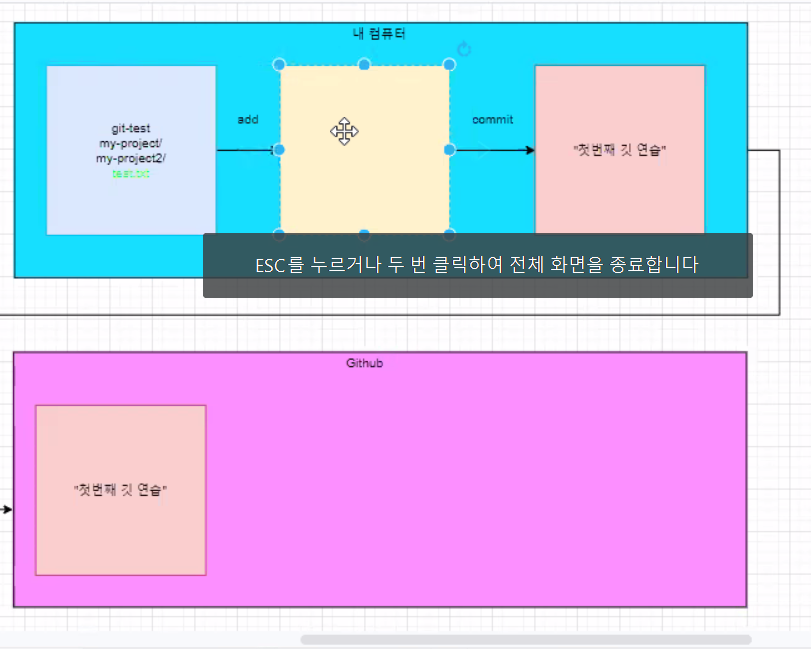
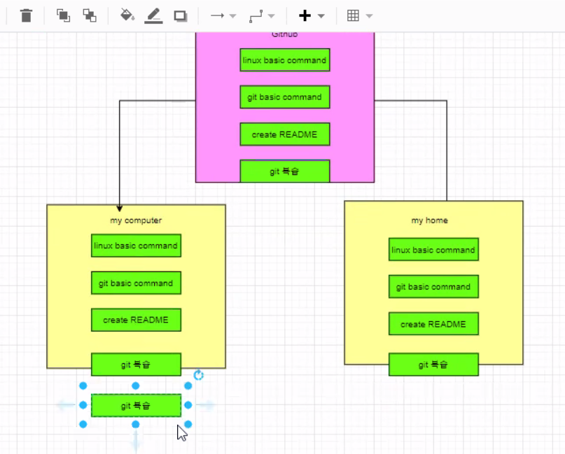

# Git basic command

> git 명령어 기초 정리


### init 

- 초기에 폴더를 깃으로 관리하겠다 라고 선언하는 명령어
- 현재 폴더에 `.git/`폴더가 생성된다.


### add

- 중간(임시) 저장 (working directory area에 있는 것을 stage area로 올려주는 것)

- `git.add .` 명령어를 통해 전체 파일을 한번에 add 할 수 있다.

  

### commit

- add 되어 있는 파일을 하나의 버전으로 묶어주는 명령어
- `-m`옵션으로 커밋메시지를 입력할 수 있다. (말이 옵션이지 거의 필수)


### push

- 로컬에 있는 커밋기록을 원격저장소로 업로드한다. 


### (remote, config 알아서 정리하샘)


### clone

- 원격 저장소에 있는 프로젝트를 복제하는 명령어

```shell
$ git clone <원격저장소 주소>
```


### pull



- 원격 저장소에서 최근 커밋을 불러오는 명령어: Github -> my home 으로 가져오는게 pull

