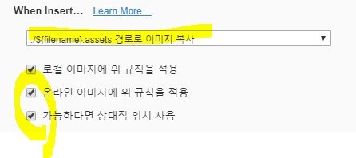

# linux 기초 문법

linux에서 사용가능한 기본 문법을 정리합니다. 


### 현재 폴더 위치

- pwd (print working directory) 

```shell
$ pwd 
```


### 폴더변경

- cd (change directory)

```shell
$ cd <이동하고싶은 폴더이름>
```


### 폴더, 파일 출력

- ls(list)
  - `-a`옵션을 추가해주면 숨김파일까지 출력해준다.(-a만 백틱으로 감싸주어서 해당 단어/구만을 블락)

```shell
$ ls - a
# -a 옵션은 숨김 파일까지 출력해준다. 
```


※ 코드블락 

ctrl + /  누르면 원래 내가 어떻게 작성했는지 진짜 markdown 문법대로 보여줌
```python
def hello():
    print("asdf")
```

"```" + python 을 치면 위와 같은 코드블락이 생김 


### 파일 생성

- touch

```shell
$ touch <생성할 파일 이름>
```


### 파일 미리보기

- cat 

```shell
$ cat <보고싶은 파일 이름>
```


### 파일 수정

- vin

```shell
$ vin <수정할 파일 이름>
```

- 여기에서 'i' 키를 누르면 끼워넣기(insert) 모드가 되고, 'esc'를 누르면 원상복귀
- esc눌러진 상태에서 `:wq ` (write and quit) 저장 후 나가기


### 파일 삭제

- rm
  - 만약 폴더를 삭제하고 싶다면 `-r` 옵션을 추가해서 삭제 가능

```shell
$ rm <삭제하고 싶은 파일 이름>
```


### 이미지 파일 올리기



- 파일 -> 환경설정 -> 이미지에서 위와 같이 설정을 하면 해당 파일이 있는 폴더 내에 새폴더가 생겨서 해당 폴더에 파일이 복사됨. 깃헙에 올려도 사진이 잘 보이게! 


git repository는 하나의 프로젝트에 하나의 repository로 쓰는 것을 추천함 

프로젝트 만들때마다 그 하위 폴더마다 git으로 관리를 하고 상위 폴더에는 웬만하면 git_init하지 마샘

최상위에서 한번에 git_init하지 마샘